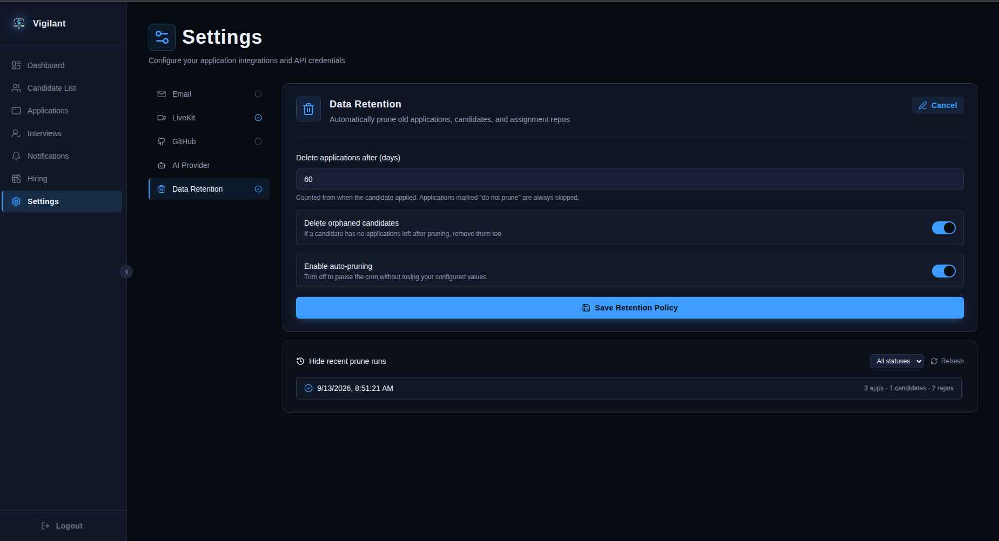

# Vigilant Admin

Admin Configuration Setup

Vigilant Admin supports the following roles:

- **Super Admin**
- **Administrator** — HR, Interviewers

### Role Hierarchy

- **Super Admin** can create HR accounts only.
- **HR** can create Interviewer accounts.

---

## Login Methods

### Super Admin Login

Super Admins log in using a **token**.

### Administrator Login

Administrators (HR & Interviewers) log in using their **email and password**.

---

## Email System Setup

To enable the email system, navigate to the configuration settings and provide the following:

| Field | Description |
|---|---|
| **AWS Access Key ID** | Your AWS access key ID |
| **AWS Secret Access Key** | Your AWS secret access key |
| **AWS Region** | The AWS region (e.g., `us-east-1`) |
| **From Email** | Sender address (e.g., `noreply@company.com`) |
| **Site Login Address** | The login URL of your site |

---

## LiveKit Configuration

To enable real-time interview rooms (video/audio), navigate to **Settings → LiveKit** and provide the following:

| Field | Description |
|---|---|
| **Host URL** | Your LiveKit server/cloud WebSocket URL (e.g., `wss://your-project.livekit.cloud`) |
| **API Key** | Your LiveKit project API key |
| **API Secret** | Your LiveKit project API secret |

---

## GitHub Integration

To let Vigilant push generated code to a GitHub organization, navigate to **Settings → GitHub** and provide the following:

| Field | Description |
|---|---|
| **Organization Name** | The target GitHub organization (e.g., `Oraganization-Name`) |
| **Personal Access Token** | A PAT with `repo` scope for the target organization |

:::info
Entering a new Personal Access Token replaces the existing one.
:::

---
## AI Provider Configuration

Vigilant uses an LLM to power scenario prompts. Navigate to **Settings → AI Provider** and choose one of the supported providers: **OpenAI**, **Gemini**, or **Claude**.

| Field | Description |
|---|---|
| **API Key** | Your provider's API key |
| **Default Model** | The model used for scenario prompts (e.g., `gpt-4o`). Populated automatically once a valid API key is entered — models are fetched live from the provider. |

:::tip
Each provider tab (OpenAI, Gemini, Claude) is configured independently — a green check next to the tab name indicates it's already connected.
:::

:::note
To change an existing configuration, click **Edit** and re-enter your API key. For security, saved keys are never shown or pre-filled — you'll need to paste the key again to update the model or refresh the connection.
:::

---

---

## Data Retention Configuration

Vigilant can automatically prune old job applications, their associated candidates, and any leftover GitHub assignment repos once they pass a configurable age. Navigate to **Settings → Data Retention** to configure this.

| Field | Description |
|---|---|
| **Delete applications after (days)** | Number of days after a candidate applies before their application becomes eligible for deletion |
| **Delete orphaned candidates** | If enabled, a candidate record is also deleted once all of their applications have been pruned |
| **Enable auto-pruning** | Toggles the daily cleanup job on or off without discarding your configured values |

<!--  -->

:::info
The retention window is measured from the application's submission date, not from the candidate's account creation date. A candidate with multiple applications keeps each one on its own clock.
:::

:::note
Applications with status **Offered** or **Hired** are never auto-pruned, regardless of age. You can also protect any individual application from pruning by marking it **Do not prune** from the application detail view.
:::

:::tip
The **Recent prune runs** panel on this page shows a history of each cleanup pass — how many applications, candidates, and GitHub repos were deleted, and any errors encountered (for example, if a GitHub repo couldn't be deleted because the PAT lacked permissions). Use this to confirm the job is running as expected before relying on it.
:::

---