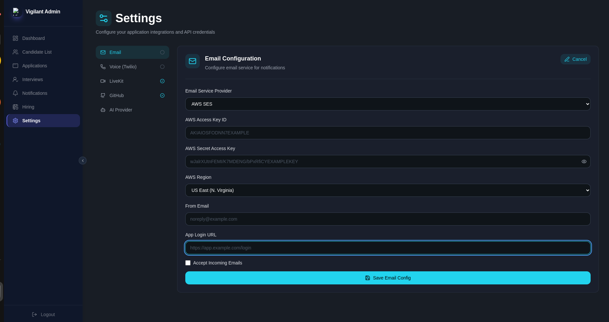
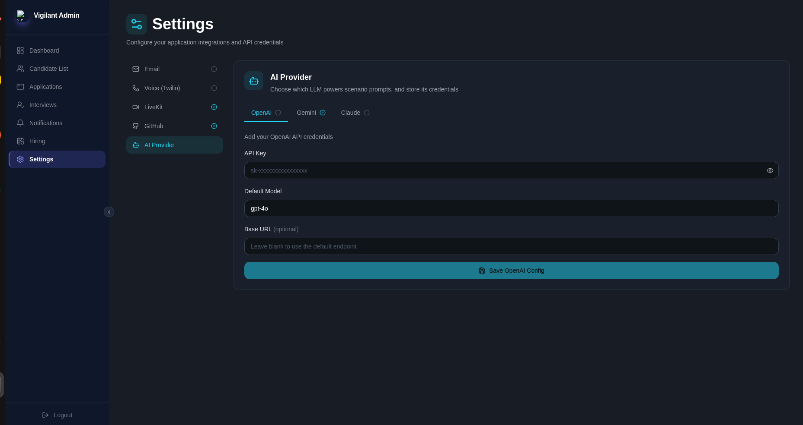

# Vigilant Admin

Admin Configuration Setup

Vigilant Admin supports the following roles:

- **Super Admin**
- **Administrator** — HR, Interviewers

### Role Hierarchy

- **Super Admin** can create HR accounts only.
- **HR** can create Interviewer accounts.

---

## Login Methods

### Super Admin Login

Super Admins log in using a **token**.

### Administrator Login

Administrators (HR & Interviewers) log in using their **email and password**.

---

## Email System Setup

To enable the email system, navigate to the configuration settings and provide the following:

| Field | Description |
|---|---|
| **AWS Access Key ID** | Your AWS access key ID |
| **AWS Secret Access Key** | Your AWS secret access key |
| **AWS Region** | The AWS region (e.g., `us-east-1`) |
| **From Email** | Sender address (e.g., `noreply@company.com`) |
| **Site Login Address** | The login URL of your site |

---

## LiveKit Configuration

To enable real-time interview rooms (video/audio), navigate to **Settings → LiveKit** and provide the following:

| Field | Description |
|---|---|
| **Host URL** | Your LiveKit server/cloud WebSocket URL (e.g., `wss://your-project.livekit.cloud`) |
| **API Key** | Your LiveKit project API key |
| **API Secret** | Your LiveKit project API secret |

---

## GitHub Integration

To let Vigilant push generated code to a GitHub organization, navigate to **Settings → GitHub** and provide the following:

| Field | Description |
|---|---|
| **Organization Name** | The target GitHub organization (e.g., `quickcourse-xyz`) |
| **Personal Access Token** | A PAT with `repo` scope for the target organization |

:::info
Entering a new Personal Access Token replaces the existing one.
:::

---

## AI Provider Configuration

Vigilant uses an LLM to power scenario prompts. Navigate to **Settings → AI Provider** and choose one of the supported providers: **OpenAI**, **Gemini**, or **Claude**.

| Field | Description |
|---|---|
| **API Key** | Your provider's API key |
| **Default Model** | The model used for scenario prompts (e.g., `gpt-4o`) |
| **Base URL** *(optional)* | Custom endpoint; leave blank to use the provider's default |

:::tip
Each provider tab (OpenAI, Gemini, Claude) is configured independently — a green check next to the tab name indicates it's already connected.
:::

---

## Usage