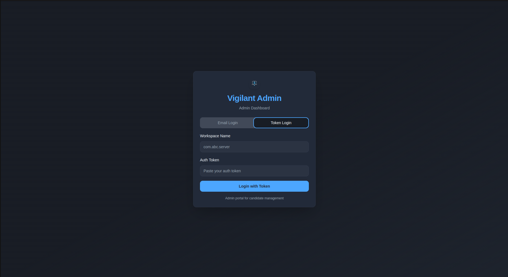
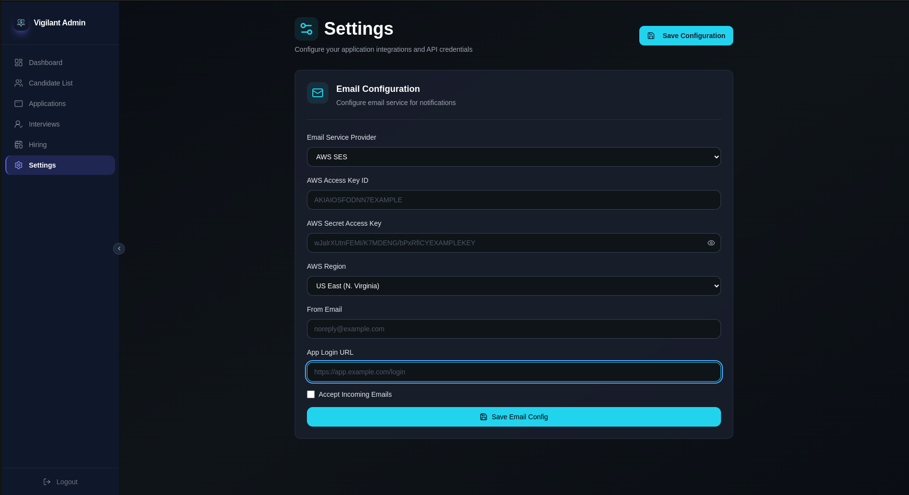

# Vigilant Admin

Admin Configuration Setup

Vigilant Admin supports the following roles:

- **Super Admin**
- **Administrator** — HR, Interviewers

### Role Hierarchy

- **Super Admin** can create HR accounts only.
- **HR** can create Interviewer accounts.

---

## Login Methods

### Super Admin Login

Super Admins log in using a **token**.

### Administrator Login

Administrators (HR & Interviewers) log in using their **email and password**.

---

## System Configuration

:::info
Only **Super Admins** can view or modify system configuration parameters.
:::

---

## Email System Setup

To enable the email system, navigate to the configuration settings and provide the following:

| Field | Description |
|---|---|
| **AWS Access Key ID** | Your AWS access key ID |
| **AWS Secret Access Key** | Your AWS secret access key |
| **AWS Region** | The AWS region (e.g., `us-east-1`) |
| **From Email** | Sender address (e.g., `noreply@company.com`) |
| **Site Login Address** | The login URL of your site |

## Usage

