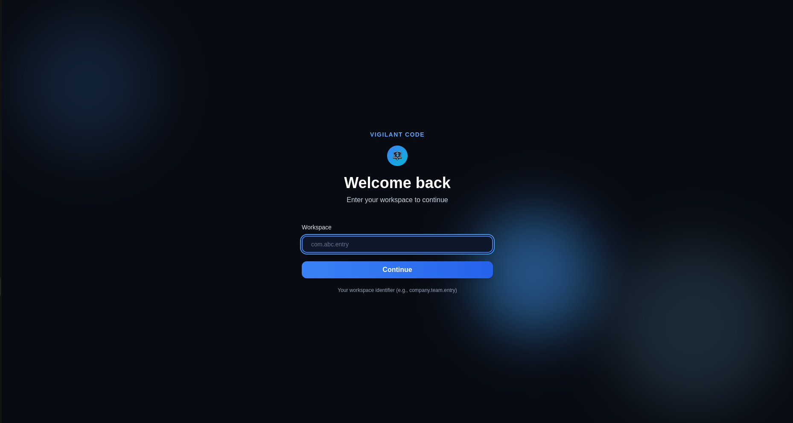
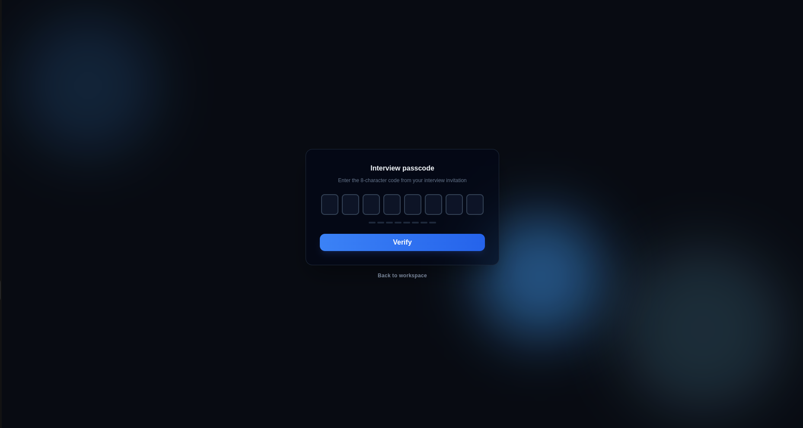
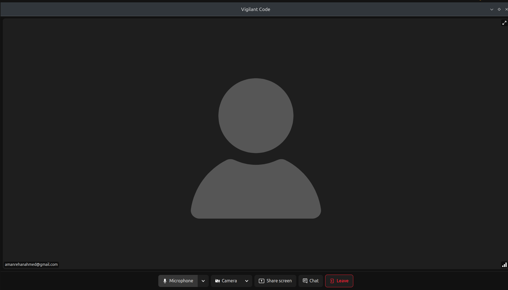
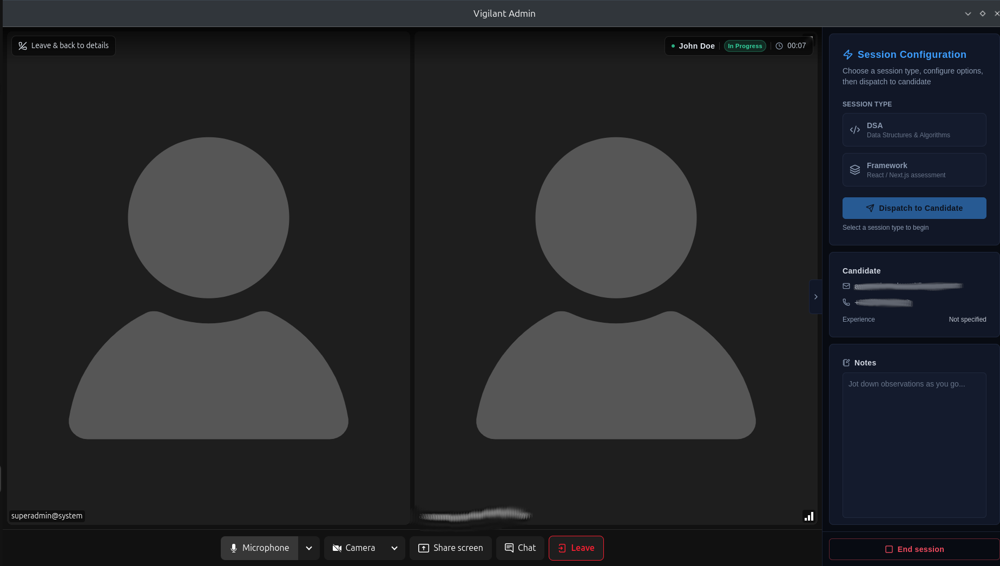
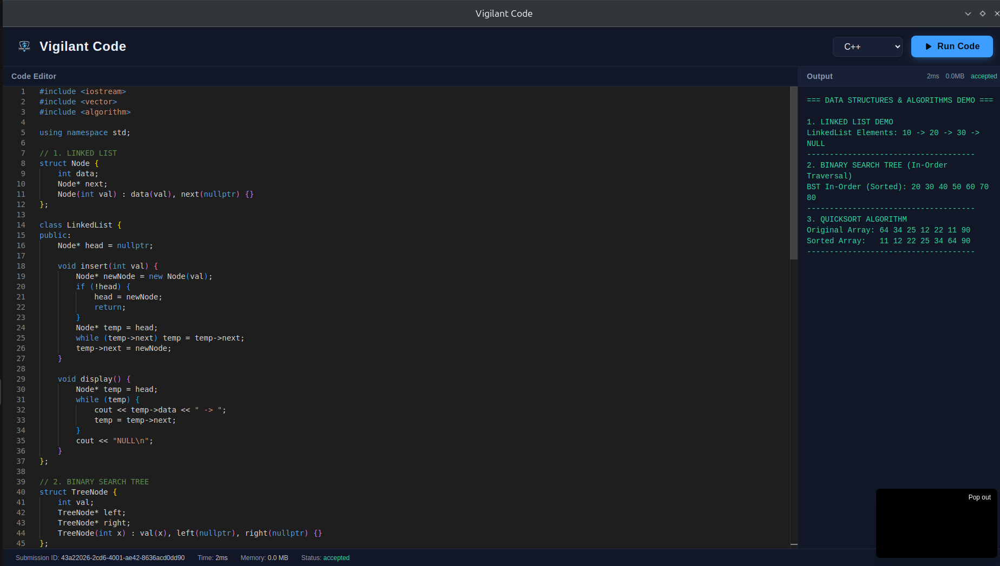
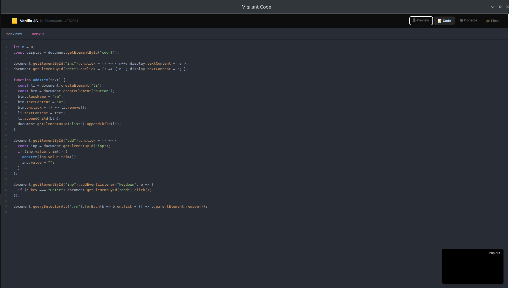

# Vigilant Code

Candidate Interview Environment

Vigilant Code is the candidate-facing side of the platform — the interview room and live code editor a candidate enters once an interviewer dispatches a session from Vigilant Admin.

### Candidate Flow

- Candidate opens their **workspace** link.
- Candidate enters the **interview passcode** from their invitation.
- Candidate joins the **video interview room**.
- Interviewer dispatches a **session type**, and the **code editor** loads for the candidate.

---

## Workspace Entry

Candidates start by entering their organization's workspace identifier (e.g. `company.team.entry`) to reach the correct interview environment.

---

## Interview Passcode

After selecting a workspace, the candidate enters the 8-character passcode from their interview invitation to verify their identity and unlock the session.

:::info
The passcode is tied to a specific interview invitation and workspace — candidates without a valid code cannot proceed.
:::

---

## Interview Room

Once verified, the candidate joins a live video room (powered by LiveKit) with standard call controls — microphone, camera, screen share, chat, and leave.

The interviewer sees a mirrored view in Vigilant Admin, alongside session controls to configure and dispatch the coding exercise.

---

## Session Types

From Vigilant Admin, the interviewer chooses a session type before dispatching it to the candidate:

| Session Type | Description |
|---|---|
| **DSA** | Data Structures & Algorithms — a language-based code editor (C, C++, Java, Python, JS) with a **Run Code** button and an output/results panel |
| **Framework** | React / Next.js (or Vanilla JS) assessment — a mini IDE with editable project files, **Preview**, **Code**, **Console**, and **Files** tabs |

Once dispatched, the exercise loads directly in the candidate's browser inside the interview room.

---

## DSA Editor

The DSA editor gives the candidate a language selector, a code editor pane, and an output panel showing execution time, memory usage, and status (e.g. `accepted`) after each run.

---

## Framework Editor

The Framework editor is a lightweight project workspace — candidates can switch between files (e.g. `index.html`, `index.js`), and toggle between **Preview**, **Code**, **Console**, and **Files** views to build and test their solution live.

---

## Usage