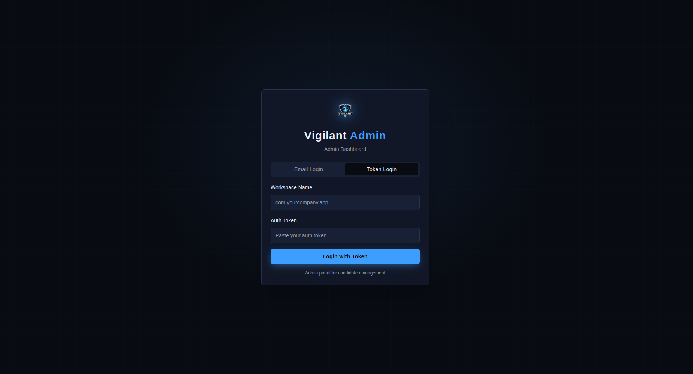
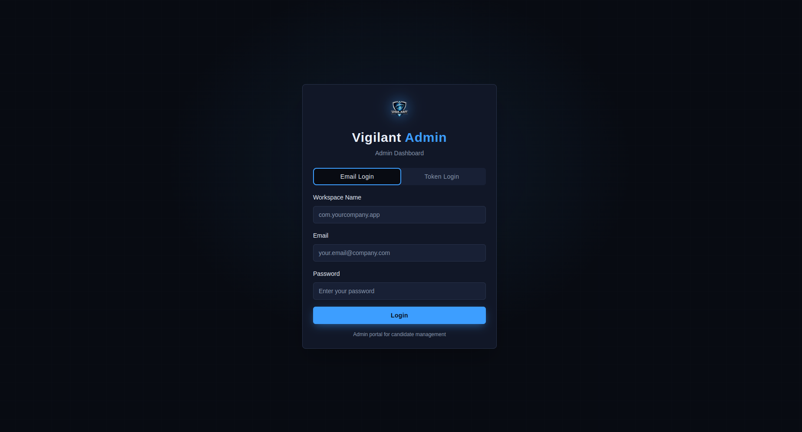
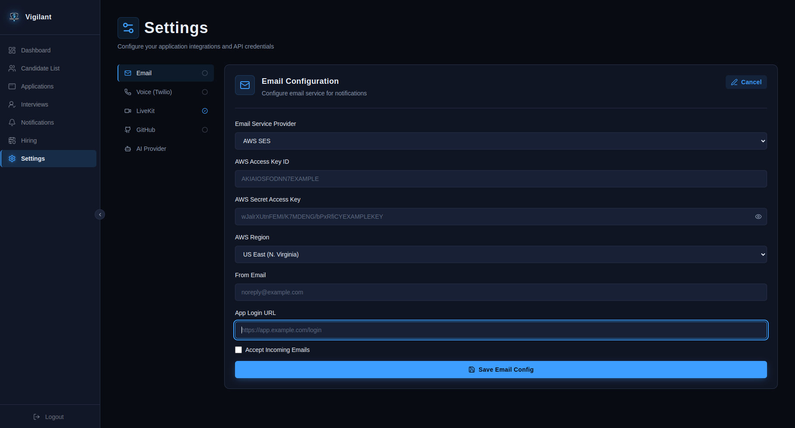
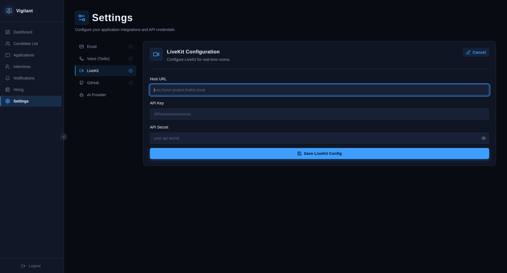
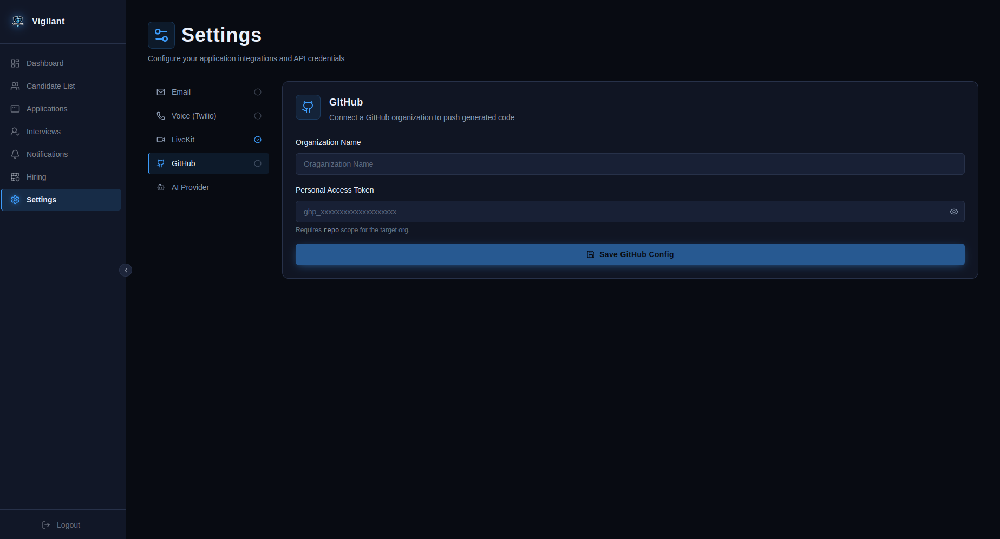
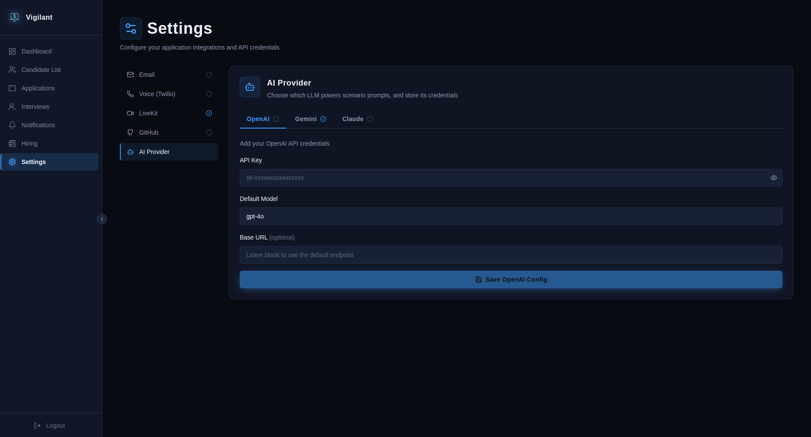
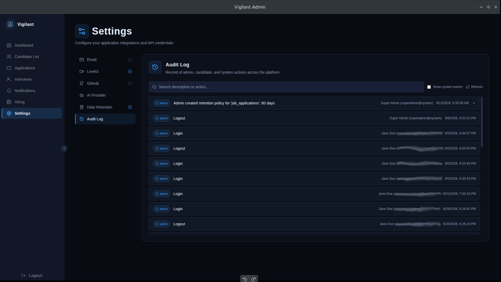

# Vigilant Admin

Admin Configuration Setup

Vigilant Admin supports the following roles:

- **Super Admin**
- **Administrator** — HR, Interviewers

### Role Hierarchy

- **Super Admin** can create HR accounts only.
- **HR** can create Interviewer accounts.

---

## Login Methods

### Super Admin Login

Super Admins log in using a **token**.

### Administrator Login

Administrators (HR & Interviewers) log in using their **email and password**.

---

## Email System Setup

To enable the email system, navigate to the configuration settings and provide the following:

| Field | Description |
|---|---|
| **AWS Access Key ID** | Your AWS access key ID |
| **AWS Secret Access Key** | Your AWS secret access key |
| **AWS Region** | The AWS region (e.g., `us-east-1`) |
| **From Email** | Sender address (e.g., `noreply@company.com`) |
| **Site Login Address** | The login URL of your site |

---

## LiveKit Configuration

To enable real-time interview rooms (video/audio), navigate to **Settings → LiveKit** and provide the following:

| Field | Description |
|---|---|
| **Host URL** | Your LiveKit server/cloud WebSocket URL (e.g., `wss://your-project.livekit.cloud`) |
| **API Key** | Your LiveKit project API key |
| **API Secret** | Your LiveKit project API secret |

---

## GitHub Integration

To let Vigilant push generated code to a GitHub organization, navigate to **Settings → GitHub** and provide the following:

| Field | Description |
|---|---|
| **Organization Name** | The target GitHub organization (e.g., `Oraganization-Name`) |
| **Personal Access Token** | A PAT with `repo` scope for the target organization |

:::info
Entering a new Personal Access Token replaces the existing one.
:::

---
## AI Provider Configuration

Vigilant uses an LLM to power scenario prompts. Navigate to **Settings → AI Provider** and choose one of the supported providers: **OpenAI**, **Gemini**, or **Claude**.

| Field | Description |
|---|---|
| **API Key** | Your provider's API key |
| **Default Model** | The model used for scenario prompts (e.g., `gpt-4o`). Populated automatically once a valid API key is entered — models are fetched live from the provider. |

:::tip
Each provider tab (OpenAI, Gemini, Claude) is configured independently — a green check next to the tab name indicates it's already connected.
:::

:::note
To change an existing configuration, click **Edit** and re-enter your API key. For security, saved keys are never shown or pre-filled — you'll need to paste the key again to update the model or refresh the connection.
:::

---

## Data Retention Configuration

Vigilant can automatically prune old job applications, their associated candidates, and any leftover GitHub assignment repos once they pass a configurable age. Navigate to **Settings → Data Retention** to configure this.

| Field | Description |
|---|---|
| **Delete applications after (days)** | Number of days after a candidate applies before their application becomes eligible for deletion |
| **Delete orphaned candidates** | If enabled, a candidate record is also deleted once all of their applications have been pruned |
| **Enable auto-pruning** | Toggles the daily cleanup job on or off without discarding your configured values |

:::info
The retention window is measured from the application's submission date, not from the candidate's account creation date. A candidate with multiple applications keeps each one on its own clock.
:::

:::note
Applications with status **Offered** or **Hired** are never auto-pruned, regardless of age. You can also protect any individual application from pruning by marking it **Do not prune** from the application detail view.
:::

:::tip
The **Recent prune runs** panel on this page shows a history of each cleanup pass — how many applications, candidates, and GitHub repos were deleted, and any errors encountered (for example, if a GitHub repo couldn't be deleted because the PAT lacked permissions). Use this to confirm the job is running as expected before relying on it.
:::

---

## Audit Log

Vigilant records a running audit log of admin, candidate, and system actions across the platform. Navigate to **Settings → Audit Log** to view it.

:::info
Only **Super Admin** and **HR** roles can view the audit log. Interviewers do not have access to this tab.
:::

### Entry Types

Each entry is tagged with an actor type:

| Actor Type | Description |
|---|---|
| **Admin** | An action taken by a Super Admin or HR/Interviewer account. Shown as `Name (email)`. If the admin account has since been deleted, the entry shows **Deleted admin**. |
| **Candidate** | An action taken by a candidate. Shown as `Name (email)`, or **Unknown candidate** if the candidate record no longer exists. |
| **System** | An automated action (e.g. the retention cron or email worker). Shown using the source tag recorded at the time, such as `system:retention_cron` or `system:email_worker`. |

By default, system events are hidden from the list — toggle **Show system events** to include them.

### Filtering & Search

| Control | Description |
|---|---|
| **Search** | Free-text search across the entry's description and action fields. |
| **Show system events** | Toggles visibility of automated/system-generated entries. |
| **Refresh** | Re-fetches the current page from the server. |

The underlying endpoint also supports filtering by `entity_type`, `entity_id`, `admin_id`, `candidate_id`, `action`, `actor_type`, and a `from`/`to` date range, though these aren't yet exposed as UI controls.

### Entry Details

Entries with additional metadata (e.g. old/new values for a status change) can be expanded to show the raw metadata as JSON, along with the originating IP address when available.

Results are paginated 25 at a time — use **Load more** to fetch the next page.

---